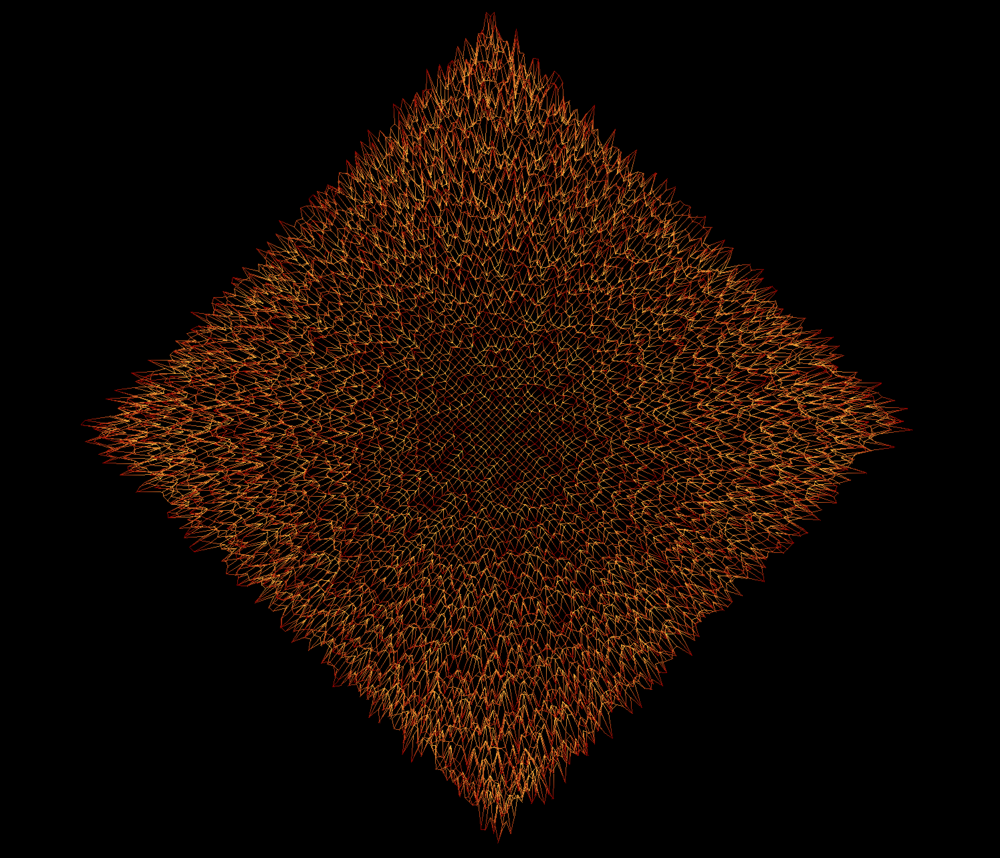
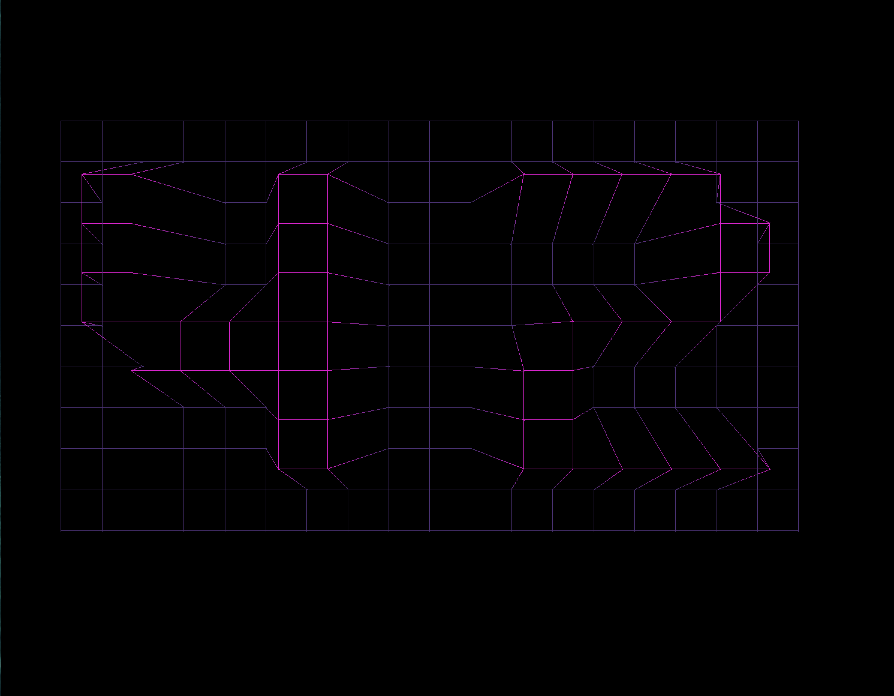
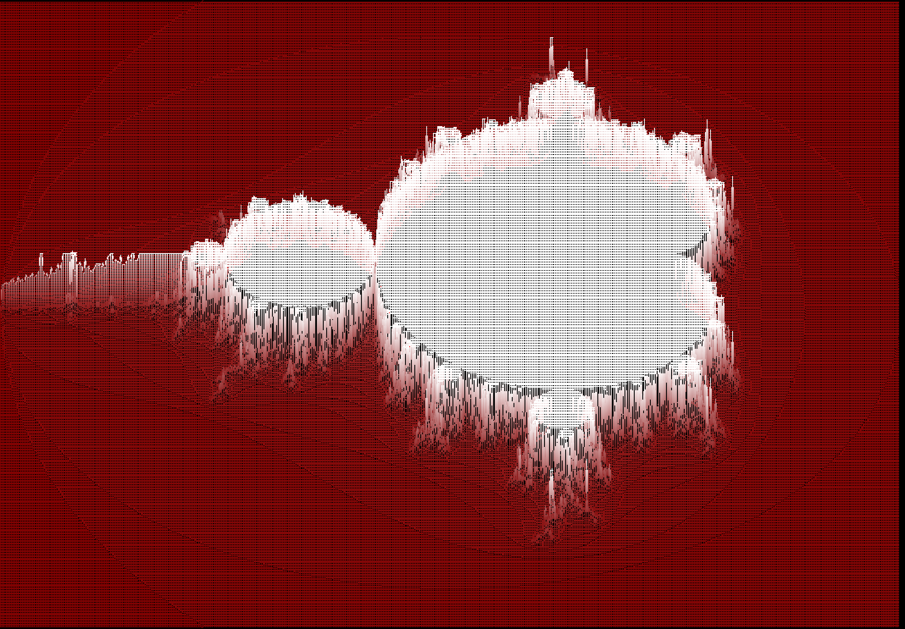

# landscape-render-FDF-

In this project implemented the basics of graphic programming, and in particular how to place points in space, how to join them with segments and most importantly how toobserve the scene from a particular viewpoint. 
Used library: miniLibX.

 

#Use {W,A,S,D} keyboard keys for x & y rotation
#Use {<} and {>} for changing perspective and {/} to off/on it
#Use {+ , -} for zoom
#Use {1, 2, 3} for color themes cganging

